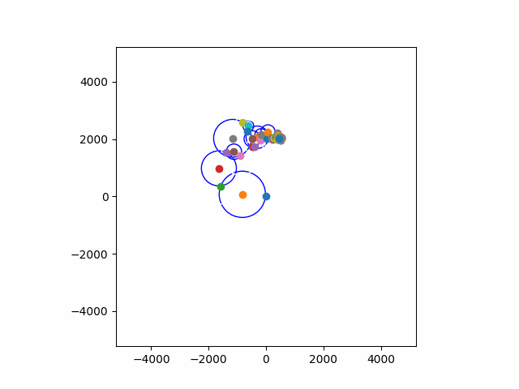

Explore Fourier analysis of closed curves in the 2D plane. Our inspiration is the elegant-as-always exposition by 3blue1brown.
The 2D curve will be represented by a parametric function in the complex plane.

A closed parametric curve $f(t)$ in the complex plane can be decomposed as
$$f(t) = \sum_{n=-\infty}^{n=+\infty}{c_n e^{n \cdot 2\pi i t}} $$
with complex coeffcients $c_n$ given by
$$c_n=\int_0^1{f(t)e^{-n \cdot 2\pi i t} dt}$$

So $f(t)$ can be viewed as a (possibly infinite) sum of rotating vectors $e^{n \cdot 2\pi i t}$. Each vector rotates at a different but uniform angular velocity determined by $n$. Each vector is also scaled by the complex coefficient $c_n$, which means that its length is scaled by $|c_n|$, and that its starting angle is given by $\arg(c_n)$.

    

